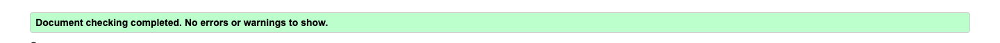
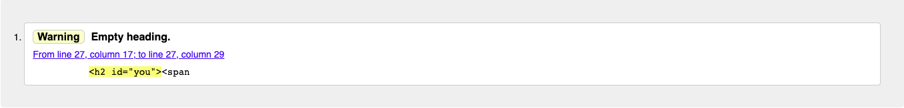
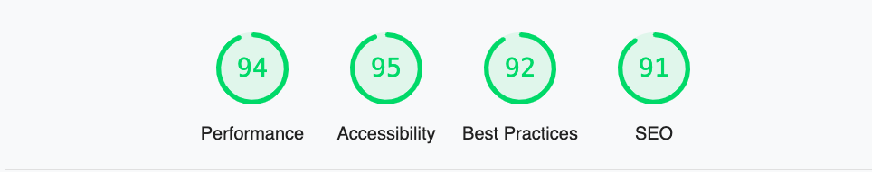
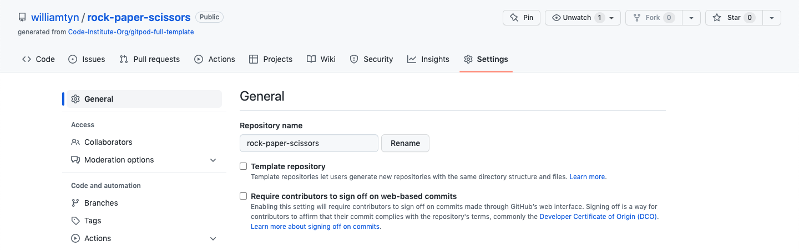
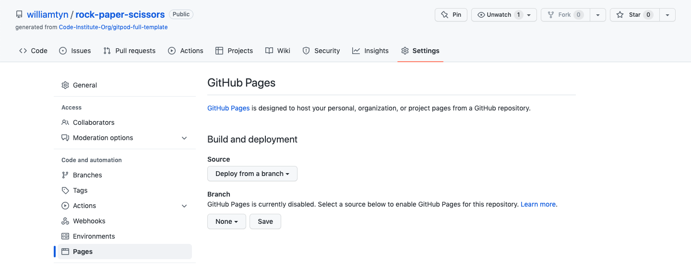
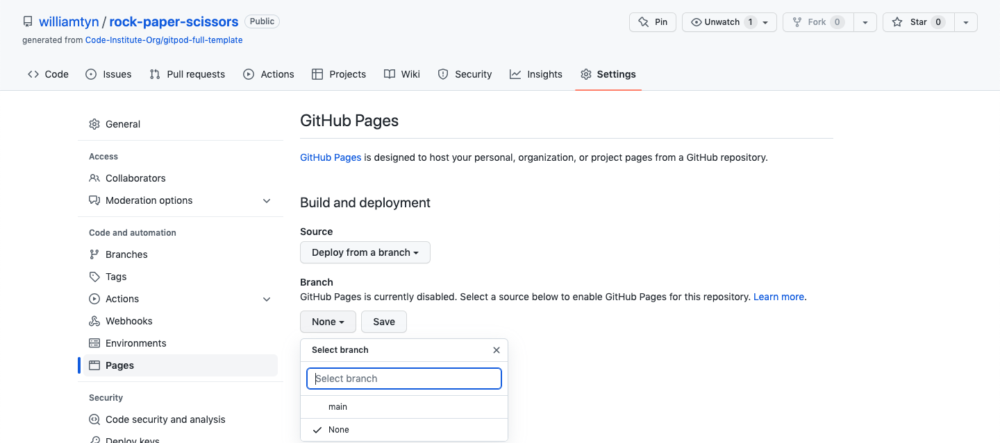
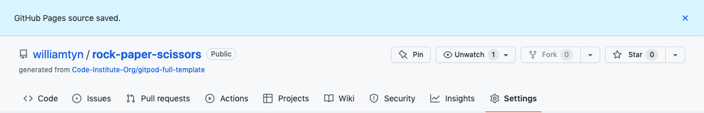
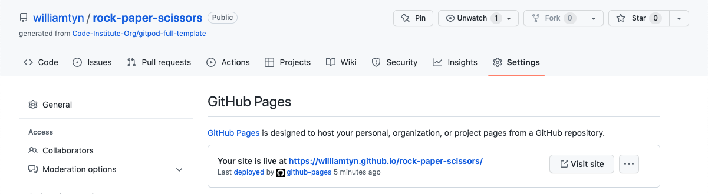
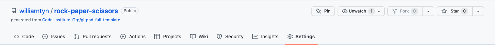
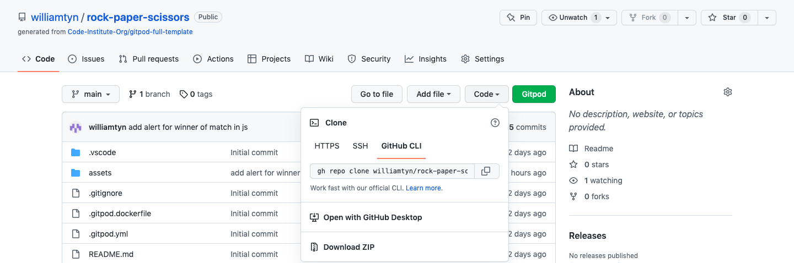

# Portfolio Project 2 - JavaScript Essentials

Rock, Paper and Scissors is one of the worlds most popular games for both adults and children.
Now you can play this wonderful game on our website.

Enjoy and Good luck!

## Live Site
[Go to site](https://williamtyn.github.io/rock-paper-scissors/) 

## Repository
[View repository](https://github.com/williamtyn/rock-paper-scissors) 

## Catalouge
<ul>
<li><a href="#target-group">Target Group</a></li>
<li><a href="#site-structure">Site Structure</a>
<ul>
<li><a href="#">Startpage</a></li>
<li><a href="#">Playarea</a></li>
<li><a href="#r">Scorearea</a></li>
<li><a href="#">Winner pop-up</a></li></ul>
<li><a href="#user-story">User Story</a></li>
<li><a href="#testing">Testing</a></li>
<li><a href="#bugs">Bugs</a></li>
<ul><li><a href="#unsolved-bugs">Unsolved Bugs</a></li></ul>
<li><a href="#responsivness">Responsivness</a></li>
<li><a href="#technologies">Technologies</a></li>
<li><a href="#deployment">Deployment</a></li>
<li><a href="#credits">Credits</a></li>
<ul>
<li><a href="#code-issues">Issues with code</a></li>
<li><a href="#student-support">Student Support</a></li>
<li><a href="#images">Images</a></li>
<li><a href="#code">Code</a></li></ul>
<li><a href="#acknowledgements">Acknowledgements</a></li></ul>
</li>
</ul>

<h2 id="target-group">Target Group</h2>
Nearly everybody in the world have played rock, paper scissor with their hands. Because many interact with digital games is this game perfect for everyone that wants to play this game, but in a digital environment, maybe because you don´t have a friend nearby to play with.

<h2 id="site-structure">Site Structure</h2>
Rock, Paper, Scissors is a one page website for the ones who want to play this game. 

<h3 id="#">Startpage</h3>
<h3 id="#">Playarea</h3>
<h3 id="#">Scorearea</h3>
<h3 id="#">Winner pop-up</h3>

<h2 id="user-story">User Story</h2>
As a user and player on the website i want to be able to have fun playing a challenge game with elements of chance. 
End user goal: Have a chance to win agains the computer with maximum attempts.  
End user goal: Provide a challenging game with increasing levels of difficulty to entertain online users.

<h2 id="testing">Testing</h2>
<li><a href="https://validator.w3.org/#validate_by_input" target="_blank" rel="noopener">HTML5 Validation</a> - Validated the HTML5 code.</li> 

<li><a href="https://jigsaw.w3.org/css-validator/" target="_blank" rel="noopener">CSS Validation</a> - Validated the code</li>

<li><a href="https://jshint.com/" target="_blank" rel="noopener">Javascript Validation</a> - Validated the code</li>

<li><a href="https://web.dev/measure/" target="_blank" rel="noopener">Lighthouse</a> - See scoring below</li>

<h2 id="deployment">Deployment</h2>
The website was deployed to GitHub Pages.

### How the site was deployed

#### 1. Settings in GitHub repository
Go to <b>settings</b> in the GitHub repository of the site.

#### 2. Go to Github Pages
Go to <b>pages</b> in the menu on the left side.

#### 3. Source and branch
Set the <b>source</b> to "Deploy from a branch".
Change the <b>branch</b> to "main" <b>click</b> "save".

#### 4. Confirmation
Wait for confirmation that the source have been <b>saved</b>.

#### 5. Your site is live
It can take a few minutes before you can see your <b>link</b> to the hosted website.

### How to fork repository

1. Log into GitHub and locate repository
2. On the right side of the page select the <b>fork</b> option to create and copy of the original.

### How to create a Local Clone

1. Under the repository name, click on the <b>code</b> tab.
2. In the clone box, HTTPS tab, click on the <b>clipboard</b> icon.
3. In your IED open GitBash.
4. Changed the current working directory to the location you want the cloned directory to be made.
5. Type <b>git clone</b> and then paste the URL copied from GitHub.
6. Press <b>enter</b> and the local clone will be created.

