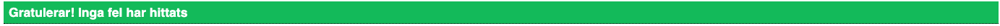
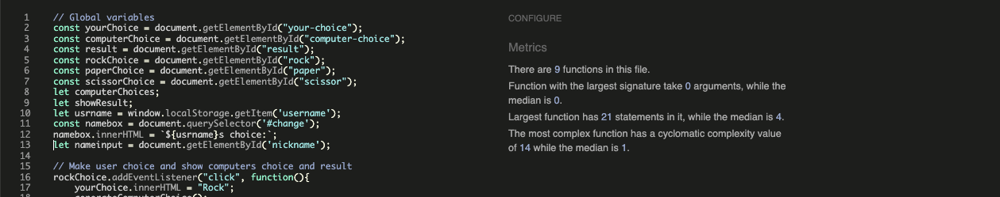

# Portfolio Project 2 - JavaScript Essentials

Rock, Paper and Scissors is one of the worlds most popular games for both adults and children.
Now you can play this wonderful game on our website.

Enjoy and Good luck!

## Live Site
[Go to site](https://williamtyn.github.io/rock-paper-scissors/) 

## Repository
[View repository](https://github.com/williamtyn/rock-paper-scissors) 

## Catalouge
<ul>
<li><a href="#target-group">Target Group</a></li>
<li><a href="#site-structure">Site Structure</a>
<ul>
<li><a href="startpage">Startpage</a></li>
<li><a href="playarea">Playarea</a></li>
<li><a href="scorearear">Scorearea</a></li>
<li><a href="pop">Winner pop-up</a></li></ul>
<li><a href="#user-story">User Story</a></li>
<li><a href="#testing">Testing</a></li>
<li><a href="#bugs">Bugs</a></li>
<ul><li><a href="#unsolved-bugs">Unsolved Bugs/optimal features</a></li></ul>
<li><a href="#responsivness">Responsivness</a></li>
<li><a href="#technologies">Technologies</a></li>
<li><a href="#deployment">Deployment</a></li>
<li><a href="#credits">Credits</a></li>
<ul>
<li><a href="#code-issues">Issues with code</a></li>
<li><a href="#student-support">Student Support</a></li>
<li><a href="#images">Images</a></li>
<li><a href="#code">Code</a></li></ul>
<li><a href="#acknowledgements">Acknowledgements</a></li></ul>
</li>
</ul>

<h2 id="target-group">Target Group</h2>
Nearly everybody in the world have played rock, paper scissor with their hands. Because many interact with digital games is this game perfect for everyone that wants to play this game, but in a digital environment, maybe because you don´t have a friend nearby to play with.

<h2 id="site-structure">Site Structure</h2>
Rock, Paper, Scissors is a one page website for the ones who want to play this game. 

<h3 id="startpage">Startpage</h3>

#### How to.. and Rules
As a new user the startpage is there to clarify how you play rock, paper,scissors and the rules of the game. Everything to minimize possible questions about the game.

#### Choose your nickname
As a player you must enter you player username to play the game. When you click "Start Game!" you can enter and play.

<h3 id="playarea">Playarea</h3>
On the playarea you can always find the name of the game and i reminder of the rules. The playarea also contains the bottons for you as a player to choose from along with the result and the scores for both you and the computer. Here you can see your entered username and this will remain the same as long as you keep playing and don´t exit the browser.

<h3 id="scorearea">Scorearea</h3>
The scores will be updated automatically as you win or lose. When you or the computer reach 3 wins, the match is over.

<h3 id="pop">Winner pop-up</h3>
When you as a player or the computer wins. You will se a pop-up with the information which the winner is. After that you can choose to play one more match.

<h2 id="user-story">User Story</h2>
As a user and player on the website i want to be able to have fun playing a challenge game with elements of chance. 
 **End user goal:** Have a chance to win agains the computer with maximum attempts.  
 **End site owner goals:** Provide a challenging game with increasing levels of difficulty to entertain online users.
 

<h2 id="testing">Testing</h2>
<li><a href="https://validator.w3.org/#validate_by_input" target="_blank" rel="noopener">HTML5 Validation</a> - Validated the HTML5 code.</li> 

<li><a href="https://jigsaw.w3.org/css-validator/" target="_blank" rel="noopener">CSS Validation</a> - Validated the code</li>

<li><a href="https://jshint.com/" target="_blank" rel="noopener">Javascript Validation</a> - Validated the code</li>

<li><a href="https://web.dev/measure/" target="_blank" rel="noopener">Lighthouse</a> - See scoring below</li>

<h2 id="bugs">Bugs</h2>
The only bug i can find on the website is on the index.html. Because the script runs before the user have added a username. You can see in the console <em>"Uncaught TypeError: Cannot set properties of null (setting 'innerHTML')".</em>. If i had more time i have made 2 separated script files to run the index javascript in a separated script file from where the game script runs.

<h3 id="unsolved-bugs">Unsolved Bugs/optimal features</h3>

#### Press enter to play
Today the user need to click "Enter Game!" with the mouse to play. In future features i will add eventlistener for enter so the player can enter their nickname and press enter to play.

#### Images to choices
I have added images rock, paper and scissor to images. I had a plan to add theese images to show instead of the text: Rock, Papper and Scissors in the "'Username'" Choice and "Computer Choise". Due to lack of deadlinetime and that this was not an expectation from the user or customer. I´v added this to future feature.

<h2 id="responsivness">Responsivness</h2>
The responsive design was tested with <a href="https://developer.chrome.com/docs/devtools/" target="_blank" rel="noopener">Google Chrome DevTools</a>. The testing of responsivness included Smartphones, Tablets and bigger screens. Media Queries was added in CSS for screens with 700px width and below.

<h2 id="technologies">Tecnhologies Used</h2>

* [HTML5](https://www.w3.org/TR/2014/REC-html5-20141028/introduction.html)- Used for the content and structure of site
* [CSS](https://www.w3.org/Style/CSS/Overview.en.html) - Used for styling of site
* [Javascript](https://www.javascript.com/) - Used to create dynamic and interactive web content
* [Google Fonts](https://fonts.google.com/) - Used for styling of fonts 
* [Font Awesome](https://fontawesome.com/) - Setup ready but no need for use in this sprint
* [Chrome Dev Tools](https://developer.chrome.com/docs/devtools/) - Used for testing of different code, very used with creating responsiveness of site and see console.log when bulding in javascript
* [Gitpod](https://www.gitpod.io/)- Creating and hosting of site
* [Github](https://github.com/)- Used to deploy the site
* [Multi Device Website Mockup Generator](https://techsini.com/multi-mockup/index.php) - Used to display homepage on different devices
* [Convertio](https://convertio.co/) - For converting jpg to webp for smaller file size

<h2 id="deployment">Deployment</h2>
The website was deployed to GitHub Pages.

### How the site was deployed

#### 1. Settings in GitHub repository
Go to <b>settings</b> in the GitHub repository of the site.

#### 2. Go to Github Pages
Go to <b>pages</b> in the menu on the left side.

#### 3. Source and branch
Set the <b>source</b> to "Deploy from a branch".
Change the <b>branch</b> to "main" <b>click</b> "save".

#### 4. Confirmation
Wait for confirmation that the source have been <b>saved</b>.

#### 5. Your site is live
It can take a few minutes before you can see your <b>link</b> to the hosted website.

### How to fork repository

1. Log into GitHub and locate repository
2. On the right side of the page select the <b>fork</b> option to create and copy of the original.

### How to create a Local Clone

1. Under the repository name, click on the <b>code</b> tab.
2. In the clone box, HTTPS tab, click on the <b>clipboard</b> icon.
3. In your IED open GitBash.
4. Changed the current working directory to the location you want the cloned directory to be made.
5. Type <b>git clone</b> and then paste the URL copied from GitHub.
6. Press <b>enter</b> and the local clone will be created.

<h2 id="credits">Credits</h2>

<h3 id="code-issues">Issues with code</h3>

Many of my issues with both CSS and Javascript was partly resolved thanks to [Stack Overflow](https://stackoverflow.com/) and [W3Schools](https://www.w3schools.com/).

<h3 id="student-support">Student Support</h3>

I got stuck with problem of getting element value to Javascript and thanks to Alex at Student Support at [Codeinstitute](https://codeinstitute.net/) i was able to resolve the problem.

<h3 id="images">Image</h3>

The hero image on the index.html is downloaded from [This site](https://projects.raspberrypi.org/en/projects/rock-paper-scissors) and a special thanks to the image owner.

<h3 id="code">Code</h3>

I got stuck with the function to check winner in the game and thanks to inspiration from [Miky Renato](https://github.com/mikyrenato/2nd-Project-Rock-Paper-Scissors/blob/main/assets/js/script.js) and his solution to the function i was able to build my own solution.

<h2 id="acknowledgements">Acknowledgements</h2>
This website was completed as a Portfolio Project 2 for the Fullstack Diploma at <a href="https://codeinstitute.net/" target="_blank" rel="noopener">Codeinstitute</a>. A special thanks to my Mentor Harry Dhillon for tips and tricks due to this project. The project is for educational purpose only and not for public consumption. 

William Tynér, September 2022.
[LinkedIn](https://www.linkedin.com/in/williamtyner/)